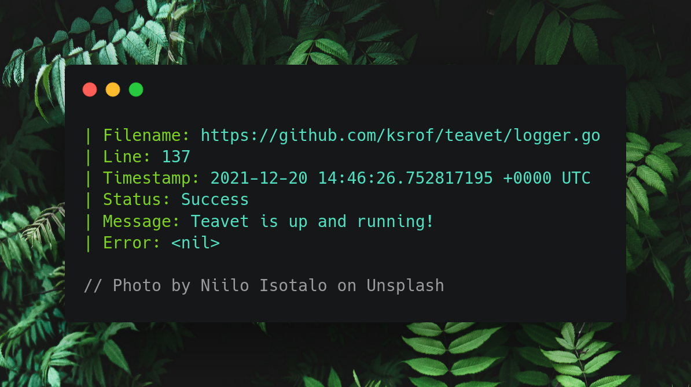

# teavet [](https://github.com/ksrof/teavet/actions)

Teavet lets you log errors with different types of characteristics, each one have their own purpose and provide different outputs accordingly.



## Install
```bash
go get github.com/ksrof/teavet
```

## Examples

### Logger types
```go
// Log with filename, line, timestamp, status, message and error
// status can be set to: success, info, warning, fatal and panic
teavet.Logger("success", "Teavet is up and running!", nil)

// Output
// ### File: path/to/file.go
// ### Line: 35
// ### Timestamp: 2021-12-20 14:46:26.752817195 +0000 UTC
// ### Status: success
// ### Message: Teavet is up and running!
// ### Error: <nil>

// Log with filename, line and timestamp
teavet.SimpleLogger()

// Output
// ### File: path/to/file.go
// ### Line: 35
// ### Timestamp: 2021-12-20 14:46:26.752817195 +0000 UTC

// Log with filename, line, timestamp and status
teavet.StatusLogger("warning")

// Output
// ### File: path/to/file.go
// ### Line: 35
// ### Timestamp: 2021-12-20 14:46:26.752817195 +0000 UTC
// ### Status: warning

// Log with filename, line, timestamp and message
teavet.MessageLogger("Teavet is up and running!")

// Output
// ### File: path/to/file.go
// ### Line: 35
// ### Timestamp: 2021-12-20 14:46:26.752817195 +0000 UTC
// ### Message: Teavet is up and running!

// Log with filename, line, timestamp and error
teavet.ErrorLogger(err)

// Output
// ### File: path/to/file.go
// ### Line: 35
// ### Timestamp: 2021-12-20 14:46:26.752817195 +0000 UTC
// ### Error: failed to initialize database...

// Log with filename, line, timestamp and error
teavet.PanicLogger(err)

// Output
// ### File: path/to/file.go
// ### Line: 35
// ### Timestamp: 2021-12-20 14:46:26.752817195 +0000 UTC
// ### Error: failed to initialize database...
```

## Todo

* Improve the logger output
* Use the fmt package

## Credits

* [Kevin Suñer](https://github.com/ksrof)

## License

The MIT License (MIT) - see [`LICENSE`](https://github.com/ksrof/teavet/LICENSE) for more details