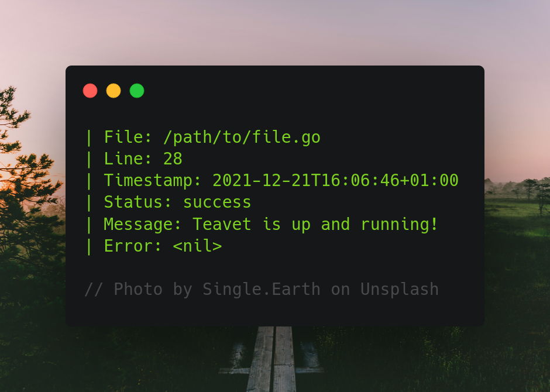

# teavet 

Teavet lets you log errors with different types of characteristics, each one has their own purpose and provide different outputs accordingly.



## Install
```bash
go get github.com/ksrof/teavet
```

## Examples

### Logger types
```go
// Log with filename, line, timestamp, status, message and error
// status can be set to: success, info, error, fatal and panic
teavet.Complete("success", "Teavet is up and running!", nil)

// Output
// | File: path/to/file.go
// | Line: 35
// | Timestamp: 2021-12-21T16:06:46+01:00
// | Status: success
// | Message: Teavet is up and running!
// | Error: <nil>

// Log with filename, line and timestamp
teavet.Simple()

// Output
// | File: path/to/file.go
// | Line: 35
// | Timestamp: 2021-12-21T16:06:46+01:00

// Log with filename, line, timestamp and status
teavet.Status("info")

// Output
// | File: path/to/file.go
// | Line: 35
// | Timestamp: 2021-12-21T16:06:46+01:00
// | Status: info

// Log with filename, line, timestamp and message
teavet.Message("Teavet is up and running!")

// Output
// | File: path/to/file.go
// | Line: 35
// | Timestamp: 2021-12-21T16:06:46+01:00
// | Message: Teavet is up and running!

// Log with filename, line, timestamp and error
teavet.Error(err)

// Output
// | File: path/to/file.go
// | Line: 35
// | Timestamp: 2021-12-21T16:06:46+01:00
// | Error: failed to initialize database...

// Log with filename, line, timestamp and error
teavet.Fatal(err)

// Output
// | File: path/to/file.go
// | Line: 35
// | Timestamp: 2021-12-21T16:06:46+01:00
// | Error: failed to initialize database...

// Log with filename, line, timestamp and error
teavet.Panic(err)

// Output
// | File: path/to/file.go
// | Line: 35
// | Timestamp: 2021-12-21T16:06:46+01:00
// | Error: failed to initialize database...
```

## Todo

* Use a another color to differentiate between field and value.

## Credits

* [Kevin Suñer](https://github.com/ksrof)

## License

The MIT License (MIT) - see [`LICENSE`](https://github.com/ksrof/teavet/LICENSE) for more details